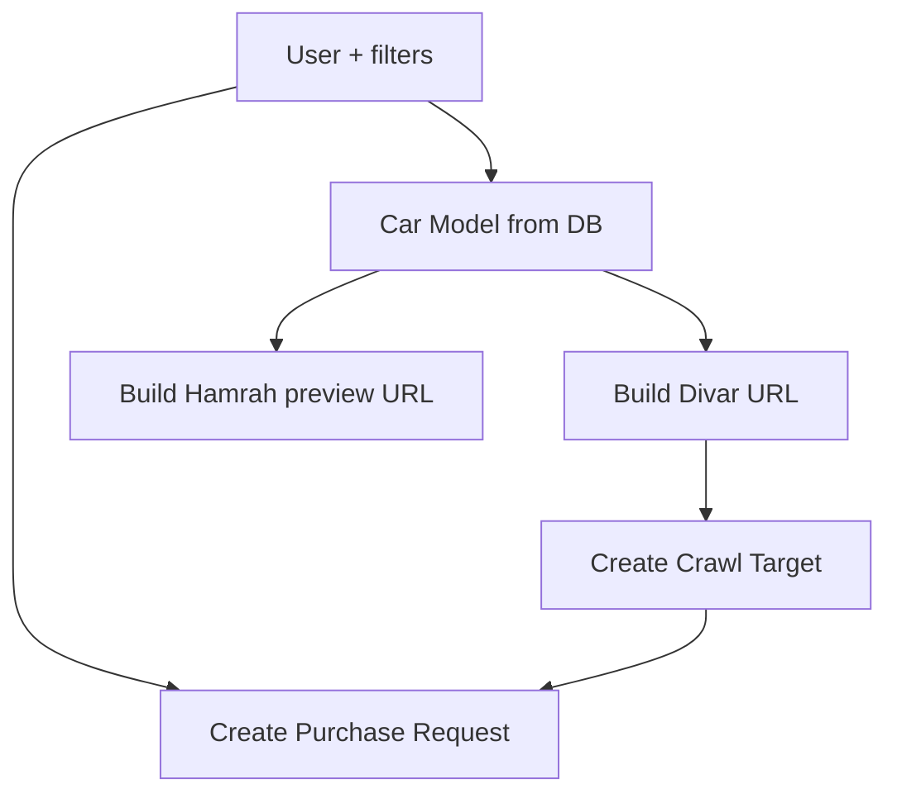
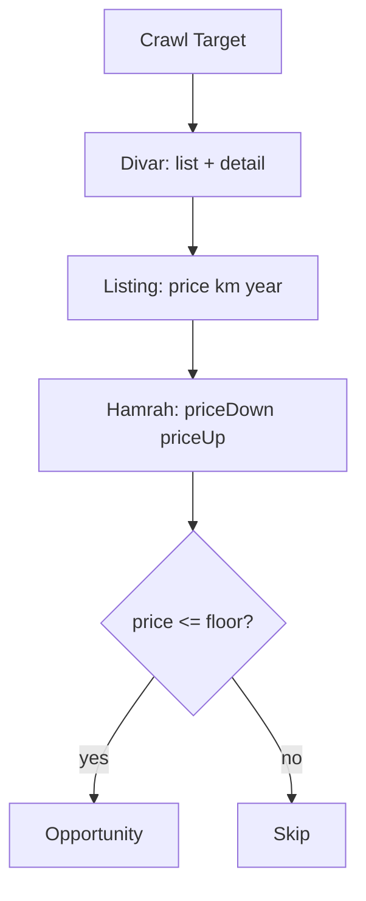
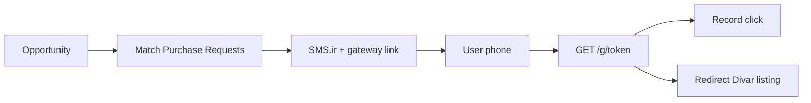

# End-to-End Flow

**Version:** 0.2.0

---

## Operator setup

Example model row:
- Divar: `car/peugeot/207i/manual-p`
- Hamrah: `peugeot/peugeot207/2749`

---

## User purchase request (v0.2.0)

---

## Crawl and opportunity detection

---

## Notification and gateway

---

## Landing page test scenario

1. Select brand → model  
2. Set year min + max km  
3. **Preview URLs** → see Divar + Hamrah links  
4. **Run scenario** → creates user + purchase request + crawl target  
5. Optional: **run crawl** → check opportunities
